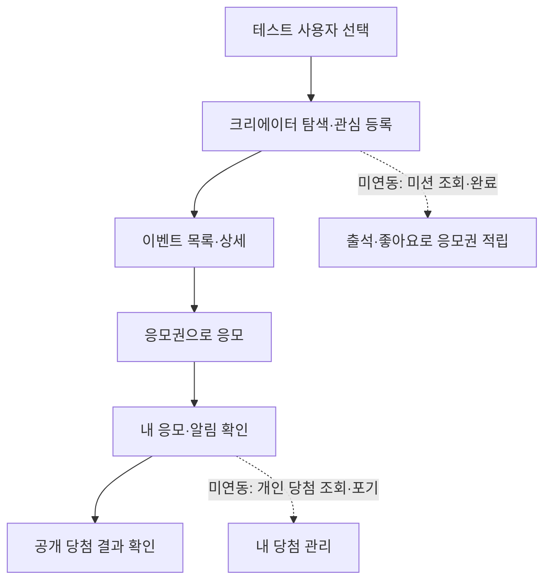
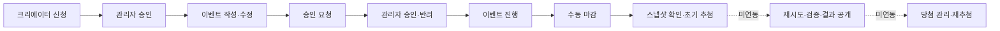

# 백엔드 API 기준 프론트 연동 현황

> 기준일: 2026-09-21
> 기준 문서: [Cking-BE API 인덱스](https://github.com/URECA-Cking/Cking-BE/blob/develop/docs/api-index.md)

## 요약

- 백엔드 외부 API: **50개**
- 프론트에서 요청을 구현한 API: **29개 (58%)**
- 주요 화면 라우트: **13개** (페이지 컴포넌트는 **12개**)
- 주의: 공개 당첨자 API는 호출하지만 응답에 `userId`가 없으므로, 현재 화면의 “나의 당첨” 판별은 정확하지 않다. 개인 당첨 API로 교체가 필요하다.

표시 기준은 다음과 같다.

- ✅ 화면에서 실제 요청·처리함
- △ 요청은 하지만 사용자 기능이 API 계약과 완전히 맞지 않음
- ❌ 백엔드 제공 API이나 프론트 미연동
- — 백엔드도 제공하지 않아 샘플/로컬 상태로 처리함

## 화면별 라우트 매트릭스

`src/App.jsx`의 와일드카드 경로를 제외한 13개 path 기준이다. `StudioEventForm`은 작성·수정의 두 경로가 공유한다.

| 화면 | 경로 | 사용 API | 구현 상태 | 미연동/보완 사항 |
| --- | --- | --- | --- | --- |
| 로그인 | `/login` | `GET /api/users`, `POST /api/demo/users/select` | ✅ | - |
| 홈 | `/` | `GET /api/events`, `GET /api/creators/{id}/tickets`, `GET /api/me/notifications` | ✅ | 관심 크리에이터는 로컬 상태 |
| 탐색 | `/explore` | `GET /api/events`, `GET /api/creators/{id}/tickets` | ✅ | Creator 목록·상세 API 미연동 |
| 내 응모 | `/my-entries` | `GET /api/events`, `GET .../tickets/history`, `GET .../winners` | △ | `GET /api/events/{id}/entries/me`, 개인 당첨 API 미연동 |
| 알림 | `/notifications` | `GET /api/me/notifications`, `PATCH .../read` | ✅ | - |
| 마이페이지 | `/my-page` | Creator 신청·내 신청, 티켓 잔액 API | ✅ | 내 당첨 관리 화면 없음 |
| 관심 크리에이터 선택 | `/onboarding/creators` | `GET /api/events`, `GET .../tickets` | △ | Creator 목록·상세 API 미연동 |
| 크리에이터 스페이스 | `/creators/:creatorId` | `GET /api/events?creatorId=`, 티켓 잔액·원장 API | △ | Creator 상세·미션 API 미연동, 게시물은 샘플 데이터 |
| 이벤트 상세·응모 | `/events/:eventId` | 이벤트 상세, 응모, 공개 당첨자 API | △ | 공개 응답으로는 나의 당첨 판별 불가 |
| 크리에이터 스튜디오 | `/studio` | 내 이벤트 목록, 삭제, 승인 요청, 수동 마감 API | ✅ | - |
| 이벤트 작성 | `/studio/events/new` | `POST /api/creator/events` | ✅ | - |
| 이벤트 수정 | `/studio/events/:eventId/edit` | 내 이벤트 목록, `PATCH /api/creator/events/{id}` | ✅ | - |
| 관리자 콘솔 | `/admin` | 승인·마감·Snapshot·초기 추첨·추첨 결과 API | △ | 재시도·공개·검증·당첨/재추첨/Dead Stream 운영 화면 없음 |

## API 대조

| 도메인 | API | 상태 | 현재 처리 또는 미연동 사유 |
| --- | --- | --- | --- |
| 공통 | `GET /api/users` | ✅ | 로그인 화면의 테스트 사용자 목록 |
| 공통 | `POST /api/demo/users/select` | ✅ | 사용자 선택 및 세션 시작 |
| Creator 조회 | `GET /api/creators` | ❌ | 이벤트 목록과 로컬 프로필로 디렉터리 구성 중 |
| Creator 조회 | `GET /api/creators/{creatorId}` | ❌ | 로컬 프로필 사용 중 |
| Mission | `GET /api/creators/{creatorId}/missions` | ❌ | 크리에이터 스페이스의 미션 UI 미연동 |
| Mission | `POST /api/creators/{creatorId}/missions/{missionId}/complete` | ❌ | 출석·좋아요 보상 루프 미연동 |
| Ticket | `GET /api/creators/{creatorId}/tickets` | ✅ | 홈·탐색·스페이스·마이페이지 잔액 |
| Ticket | `GET /api/creators/{creatorId}/tickets/history` | ✅ | 응모권 원장·내 응모 재구성 |
| Event/Entry | `GET /api/events` | ✅ | 홈·탐색·크리에이터별 이벤트 목록 |
| Event/Entry | `GET /api/events/{eventId}` | ✅ | 이벤트 상세 |
| Event/Entry | `POST /api/events/{eventId}/entries` | ✅ | UUID 멱등 키를 포함한 응모 |
| Event/Entry | `GET /api/events/{eventId}/entries/me` | ❌ | 현재는 원장 `SPEND` 기록으로 내 응모를 재구성 |
| Creator 운영 | `GET/POST /api/creator/events` | ✅ | 스튜디오 목록·생성 |
| Creator 운영 | `PATCH/DELETE /api/creator/events/{eventId}` | ✅ | 이벤트 수정·삭제 |
| Creator 운영 | `POST /api/creator/events/{eventId}/approval-request` | ✅ | 관리자 승인 요청 |
| Event 마감 | `POST /api/events/{eventId}/close` | ✅ | 크리에이터 스튜디오 수동 마감 |
| 관리자 승인 | `GET /api/admin/events/pending` | ✅ | 승인 대기 목록 |
| 관리자 승인 | `POST /api/admin/events/{eventId}/approve`, `reject` | ✅ | 승인·반려 |
| 마감/스냅샷 | `GET .../closing-status`, `GET .../snapshot` | ✅ | 추첨 운영 패널 사전 확인 |
| Drawing | `POST /api/admin/events/{eventId}/drawings` | ✅ | 초기 추첨 실행 |
| Drawing | `GET /api/admin/drawings/{drawingId}`, `result` | ✅ | 추첨 메타·관리자 결과 조회 |
| Drawing | `POST /api/admin/drawings/{drawingId}/retry` | ❌ | 실패 추첨 재시도 UI 없음 |
| Drawing | `POST /api/admin/drawings/{drawingId}/publish` | ❌ | 결과 공개 UI 없음 |
| Winner | `GET /api/events/{eventId}/winners` | △ | 공개 결과 표시는 가능하나 본인 당첨 판별에 사용할 `userId`는 응답에 없음 |
| Creator 승인 | 신청·내 신청·관리자 목록·승인·반려 API | ✅ | 로그인·마이페이지·관리자 콘솔 |
| Winner 관리 | `GET /api/me/winners`, `POST .../decline` | ❌ | 내 당첨 및 당첨 포기 화면 없음 |
| Winner 관리 | 관리자 수령·자격 박탈·상태 이력 API | ❌ | 관리자 운영 화면 없음 |
| Redraw | 생성·상세·승인·반려·실행 API | ❌ | 재추첨 운영 화면 없음 |
| Notification | `GET /api/me/notifications`, `PATCH .../read` | ✅ | 알림 목록·읽음·이벤트 이동 |
| Verification | 검증 실행·검증 이력 API | ❌ | 추첨 검증 화면 없음 |
| Stream | Dead Stream 조회·replay API | ❌ | 장애 복구 운영 화면 없음 |

## 역할별 흐름

### 사용자

### 크리에이터와 관리자

## 우선 연동 순서

1. **미션 조회·완료**: 응모권 획득 수단이 없어 사용자 핵심 순환이 닫히지 않는다.
2. **Creator 목록·상세**: 현재 로컬 프로필/이벤트 역추론을 서버 데이터로 교체한다.
3. **내 응모·내 당첨**: 원장 재구성과 공개 당첨자 `userId` 비교를 전용 API로 교체한다.
4. **Drawing 공개·검증·재시도**: 초기 추첨 이후의 관리자 운영 흐름을 완성한다.
5. **당첨 운영·재추첨·Dead Stream**: 운영자용 고급 예외 처리 기능을 추가한다.

## 백엔드에 없는 화면 기능

- 게시물 피드와 좋아요: `src/data/posts.js` 및 로컬 상태 사용
- 관심 크리에이터: 브라우저 로컬 상태 사용
- 실시간 인기·누적 응모 수: 공개 조회 API 없음
